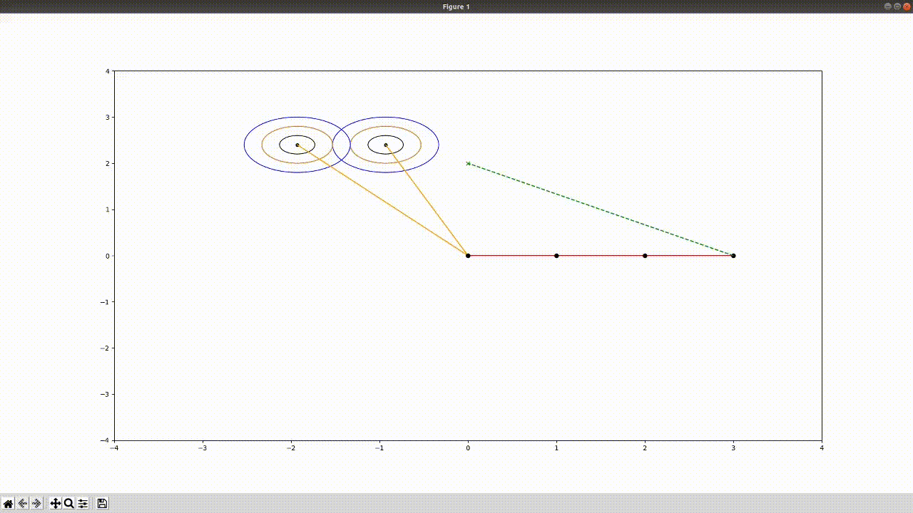

# SYS824

**Implementation of a simplified version of the obstacle avoidance algorithm for robotic arms presented in this [paper](https://www.researchgate.net/publication/334616002_On-line_collision_avoidance_for_collaborative_robot_manipulators_by_adjusting_off-line_generated_paths_An_industrial_use_case) written by Mohammad Safeea, Pedro Neto, and Richard Béarée.**

We built this project for the SYS824 (Modélisation et commande robotique) master's course at [ETS](https://www.etsmtl.ca/) and the project report (in french) can be found [here](Media/rapport.pdf). The report only details the 2D implementation, because we did the 3D implementation for fun.

Note that the code for the 2D and 3D simulations is based on [AtsushiSakai](https://github.com/AtsushiSakai)'s python code collection of robotics algorithms, more specifically, the [arm navigation](https://github.com/AtsushiSakai/PythonRobotics/tree/master/ArmNavigation) examples.

## 2D demo

## 3D demo

### System requirements
    - Python3
    - pip3
### Installing python requirements
    - pip3 install -r requirements.txt
    
### Run the code
    - cd (2D or 3D)
    - python arm_control.py